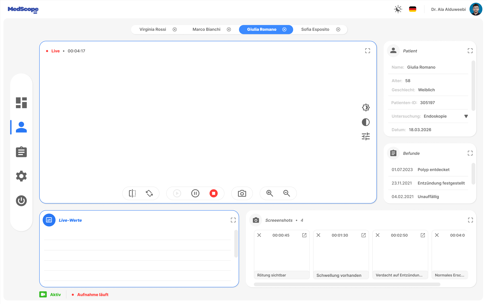

# MedScopePro

MedScopePro ist eine moderne WPF-Desktopanwendung für den medizinischen Bereich.  
Die Anwendung dient dazu, Daten aus Untersuchungen übersichtlich darzustellen und zu verwalten.

---

## Idee

Die Software ist dafür gedacht, in Verbindung mit medizinischen Untersuchungsgeräten eingesetzt zu werden.  
Sie ermöglicht es, während und nach einer Untersuchung relevante Informationen strukturiert anzuzeigen.

Dazu gehören unter anderem:
- Live-Werte während einer Untersuchung  
- Aufnahmen und Screenshots  
- Patientendaten  
- Befunde  

---

## Zielgruppe

Die Anwendung richtet sich an:
- Ärzte  
- medizinisches Fachpersonal  
- Anwender, die mit medizinischen Geräten arbeiten  

Ziel ist es, eine intuitive Oberfläche bereitzustellen, die einen schnellen Überblick über komplexe Daten ermöglicht.

---

## Architektur

Das Projekt basiert auf einer eigenen, modularen WPF-Architektur mit Fokus auf:

- Wiederverwendbare Controls  
- Klare Trennung von Control, Style und Template  
- Zentrale Steuerung über Enums und Metadaten  
- Erweiterbarkeit und Wartbarkeit  

---

## Benutzeroberfläche

Die Anwendung besteht aus:

- **TitleBar** → eigene Fenstersteuerung  
- **SideMenu** → Navigation zwischen Bereichen  
- **Content-Bereich** → dynamische Anzeige der aktuellen Ansicht  

Hauptbereiche:
- Dashboard  
- Patient  
- Reports  
- Settings  

---

## Status

Das Projekt befindet sich aktuell in Entwicklung.  
Der Fokus liegt derzeit auf der UI-Architektur und dem Aufbau der einzelnen Ansichten.

---

## Hinweis

Dieses Projekt ist ein privates Entwicklungsprojekt zur Vertiefung von WPF, UI/UX und Softwarearchitektur.

---

## UI Preview

## Design

[Figma-Entwurf ansehen](https://www.figma.com/design/CjIcdNyQByjFuCIQ5wIz3d/ProMedScope)
